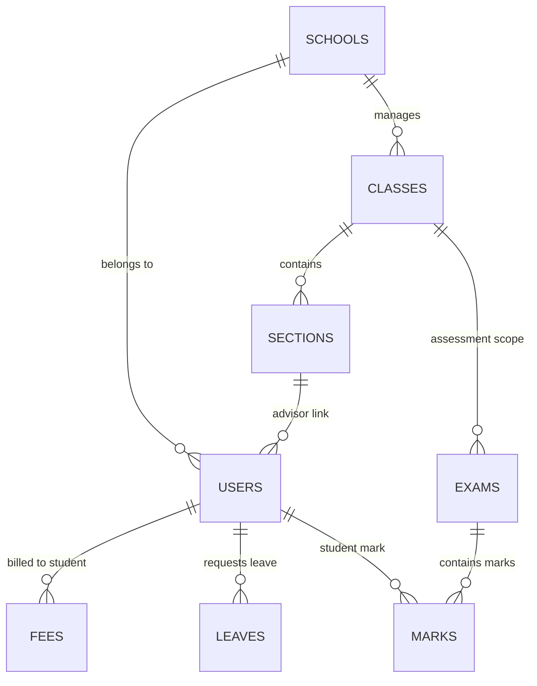
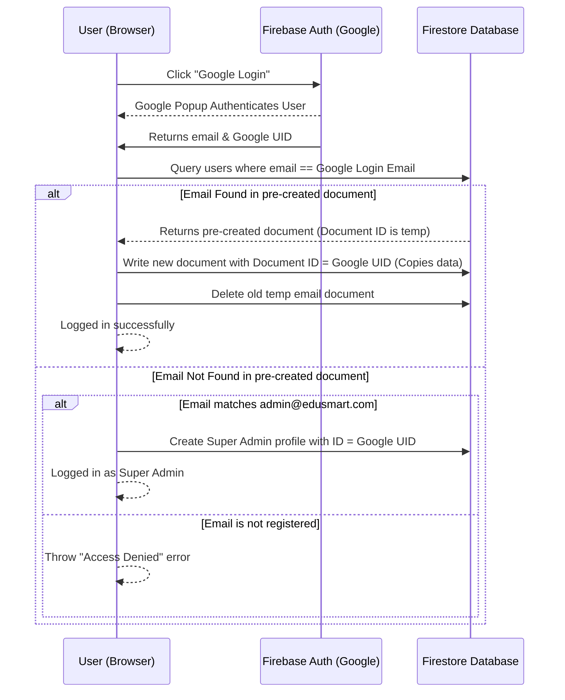

# Edu-Smart Database & Console Operations Documentation (v2.0)

This document serves as the official schema reference and database manual for the **Edu-Smart School Management SaaS**. It provides the structural specifications for Google Firebase Firestore and Storage, explaining how to manually create records, bind Google Authentications, configure security parameters, and index fields using the Firebase console.

---

## 1. Firestore Database Overview & Relationships

Edu-Smart uses a **single-database multi-tenant** structure. All data resides in top-level collections. Tenant isolation is enforced dynamically at the document level using a query filter matching the user's `schoolId`.

### Entity Relationship Model



1. **`schools`**: The core tenant element.
2. **`users`**: Global collection of accounts. Users belonging to a school have their `schoolId` field set to that school's document ID.
3. **`classes` & `sections`**: Configured by the Principal and linked to the school.
4. **`subjects`**: Course definitions linked to the school.
5. **`timetable`**: Schedule blocks representing sections and days.
6. **`attendance`**: Daily roll-call sheets.
7. **`homework` & `study_materials`**: Assignments and study materials issued to a class/section.
8. **`exams` & `marks`**: Test definitions and students' scores.
9. **`fees`**: Tuition invoices and payment status logs.
10. **`notices`**: School announcements.
11. **`leaves`**: Time-off applications.
12. **`messages`**: Multi-party chat histories.

---

## 2. Collection Schemas & Field Details

### 2.1 Collection: `schools`
Stores the metadata, active state, and billing plans for each tenant.

| Field Name | Data Type | Required/Optional | Example Value | Description |
| :--- | :--- | :--- | :--- | :--- |
| `id` | `string` | Required | `"school-springfield"` | Unique ID of the school. |
| `name` | `string` | Required | `"Springfield Academy"` | Name of the institution. |
| `address` | `string` | Optional | `"742 Evergreen Terrace"` | Physical location. |
| `phone` | `string` | Optional | `"555-0199"` | Main contact line. |
| `logoUrl` | `string` | Optional | `"https://images.../photo.png"` | Logo resource path. |
| `isActive` | `boolean` | Required | `true` | Activation state flag. |
| `planName` | `string` | Required | `"Premium"` | Active billing tier: `"Basic"` or `"Premium"`. |
| `planExpiry` | `string` | Required | `"2027-06-30T23:59:59.000Z"` | Plan expiration date (ISO 8601). |
| `principalId` | `string` | Required | `"user-principal-skinner"` | Reference to the principal user's `uid`. |
| `createdAt` | `string` | Required | `"2025-09-01T08:00:00.000Z"` | Creation timestamp (ISO 8601). |

---

### 2.2 Collection: `users`
Contains all user profiles. A user document can be created *before* the user has logged in, using their `email`. The first Google login binds their Firebase Auth `uid` as the document ID.

| Field Name | Data Type | Required/Optional | Example Value | Description |
| :--- | :--- | :--- | :--- | :--- |
| `uid` | `string` | Required | `"user-teacher-krabappel"` | Unique ID matching Firebase Auth user UID. |
| `email` | `string` | Required | `"krabappel@springfield.edu"`| Registered Google email address (saved in lowercase). |
| `name` | `string` | Required | `"Edna Krabappel"` | Full name of the user. |
| `photoUrl` | `string` | Optional | `"https://lh3.google...photo"` | Google avatar link. |
| `role` | `string` | Required | `"teacher"` | User access level: `"super_admin"`, `"principal"`, `"teacher"`, `"parent"`, `"student"`. |
| `schoolId` | `string` | Optional (Required if not super_admin) | `"school-springfield"` | School document ID link. Null for `super_admin`. |
| `isActive` | `boolean` | Required | `true` | Deactivated accounts are blocked from accessing dashboards. |
| `createdAt` | `string` | Required | `"2025-09-02T08:00:00.000Z"` | Profile creation timestamp (ISO 8601). |
| `teacherDetails` | `map` | Optional | *See details below* | Config metadata for teachers. |
| `studentDetails` | `map` | Optional | *See details below* | Config metadata for students. |
| `parentDetails` | `map` | Optional | *See details below* | Config metadata for parents. |

#### Role-Specific Field Requirements Checklist

When manually creating or editing a user profile document in the Firestore Console, you MUST include specific fields and details maps depending on their `role`:

##### 1. Super Admin
*   **`role`**: `"super_admin"`
*   **`schoolId`**: Set to `null` or omit the field (Super Admins are global and do not belong to a specific school tenant).
*   **Other Details Maps**: Omit `teacherDetails`, `studentDetails`, and `parentDetails` entirely.

##### 2. Principal
*   **`role`**: `"principal"`
*   **`schoolId`**: A valid ID of a school in the `schools` collection (e.g., `"school-springfield"`).
*   **Other Details Maps**: Omit `teacherDetails`, `studentDetails`, and `parentDetails` entirely.

##### 3. Teacher
*   **`role`**: `"teacher"`
*   **`schoolId`**: A valid school ID (e.g., `"school-springfield"`).
*   **`teacherDetails`** (Required `map`):
    *   `employeeId` (`string`): Employee ID number (e.g., `"EMP-001"`).
    *   `designation` (`string`): Staff title (e.g., `"Mathematics Teacher"`).
    *   `subjects` (`array` of `string`): List of subject IDs they teach (e.g., `["subj-math"]`).
*   **Other Details Maps**: Omit `studentDetails` and `parentDetails` entirely.

##### 4. Parent / Guardian
*   **`role`**: `"parent"`
*   **`schoolId`**: A valid school ID (e.g., `"school-springfield"`).
*   **`parentDetails`** (Required `map`):
    *   `phone` (`string`): Main contact number (e.g., `"555-0103"`).
    *   `studentIds` (`array` of `string`): List of their children's `users.uid` (e.g., `["bart@simpsons.com"]`).
*   **Other Details Maps**: Omit `teacherDetails` and `studentDetails` entirely.

##### 5. Student
*   **`role`**: `"student"`
*   **`schoolId`**: A valid school ID (e.g., `"school-springfield"`).
*   **`studentDetails`** (Required `map`):
    *   `admissionNo` (`string`): Enrollment registration number (e.g., `"ADM-99402"`).
    *   `rollNo` (`string`): Classroom roll number (e.g., `"04"`).
    *   `classId` (`string`): Document ID of their class in the `classes` collection (e.g., `"class-10"`).
    *   `sectionId` (`string`): Document ID of their section in the `sections` collection (e.g., `"sect-10a"`).
    *   `parentId` (`string`): The UID of their associated parent document in the `users` collection (e.g., `"homer@simpsons.com"`).
*   **Other Details Maps**: Omit `teacherDetails` and `parentDetails` entirely.

---

### 2.3 Collection: `classes`
Represents standard grades or year groups.

| Field Name | Data Type | Required/Optional | Example Value | Description |
| :--- | :--- | :--- | :--- | :--- |
| `id` | `string` | Required | `"class-10"` | Class document ID. |
| `schoolId` | `string` | Required | `"school-springfield"` | School isolation link. |
| `name` | `string` | Required | `"Grade 10"` | Class label. |
| `createdAt` | `string` | Required | `"2025-09-01T09:00:00.000Z"` | Creation timestamp (ISO 8601). |

---

### 2.4 Collection: `sections`
Subdivisions under each Class.

| Field Name | Data Type | Required/Optional | Example Value | Description |
| :--- | :--- | :--- | :--- | :--- |
| `id` | `string` | Required | `"sect-10a"` | Section document ID. |
| `schoolId` | `string` | Required | `"school-springfield"` | School isolation link. |
| `classId` | `string` | Required | `"class-10"` | Reference to the parent `classes` document ID. |
| `name` | `string` | Required | `"Section A"` | Section label. |
| `classTeacherId`| `string` | Optional | `"user-teacher-krabappel"` | Reference to the class teacher's `users.uid`. |

---

### 2.5 Collection: `subjects`
Course curriculum definitions.

| Field Name | Data Type | Required/Optional | Example Value | Description |
| :--- | :--- | :--- | :--- | :--- |
| `id` | `string` | Required | `"subj-math"` | Subject document ID. |
| `schoolId` | `string` | Required | `"school-springfield"` | School isolation link. |
| `name` | `string` | Required | `"Mathematics"` | Name of the subject. |
| `code` | `string` | Required | `"MATH-10"` | Curriculum course identifier. |

---

### 2.6 Collection: `timetable`
Weekly lesson schedule mappings.

| Field Name | Data Type | Required/Optional | Example Value | Description |
| :--- | :--- | :--- | :--- | :--- |
| `id` | `string` | Required | `"tt-1"` | Timetable document ID. |
| `schoolId` | `string` | Required | `"school-springfield"` | School isolation link. |
| `classId` | `string` | Required | `"class-10"` | Reference to `classes` ID. |
| `sectionId` | `string` | Required | `"sect-10a"` | Reference to `sections` ID. |
| `day` | `string` | Required | `"Monday"` | Days of the week: `"Monday"`, `"Tuesday"`, etc. |
| `slots` | `array` of `map` | Required | *See slots structure below*| Schedule slots for this day. |

#### Slots Structure
- `time` (`string`): e.g., `"09:00 - 10:00"`
- `subjectId` (`string`): Reference to `subjects` ID.
- `teacherId` (`string`): Reference to teacher `users.uid`.

---

### 2.7 Collection: `attendance`
Daily roll call lists.

| Field Name | Data Type | Required/Optional | Example Value | Description |
| :--- | :--- | :--- | :--- | :--- |
| `id` | `string` | Required | `"springfield_10_10a_2026-06-21"`| Document ID format: `{schoolId}_{classId}_{sectionId}_{date}`. |
| `schoolId` | `string` | Required | `"school-springfield"` | School isolation link. |
| `classId` | `string` | Required | `"class-10"` | Reference to `classes` ID. |
| `sectionId` | `string` | Required | `"sect-10a"` | Reference to `sections` ID. |
| `date` | `string` | Required | `"2026-06-21"` | Roll call date (YYYY-MM-DD). |
| `records` | `map` | Required | `{"user-student-bart": "present"}`| Student status map: `"present"`, `"absent"`, or `"late"`. |
| `markedBy` | `string` | Required | `"user-teacher-krabappel"` | Instructor's `users.uid`. |
| `updatedAt` | `string` | Required | `"2026-06-21T18:00:00.000Z"` | Updates timestamp (ISO 8601). |

---

### 2.8 Collection: `homework`
Daily homework assignments.

| Field Name | Data Type | Required/Optional | Example Value | Description |
| :--- | :--- | :--- | :--- | :--- |
| `id` | `string` | Required | `"hw-1"` | Homework document ID. |
| `schoolId` | `string` | Required | `"school-springfield"` | School isolation link. |
| `classId` | `string` | Required | `"class-10"` | Target `classes` reference ID. |
| `sectionId` | `string` | Required | `"sect-10a"` | Target `sections` reference ID. |
| `subjectId` | `string` | Required | `"subj-math"` | Target `subjects` reference ID. |
| `title` | `string` | Required | `"Quadratic Equations"` | Title. |
| `description` | `string` | Required | `"Solve questions 1-5."` | Instructions. |
| `dueDate` | `string` | Required | `"2026-06-23"` | Due date (YYYY-MM-DD). |
| `fileUrl` | `string` | Optional | `"https://firebasestorage.../doc.pdf"` | Document download link. |
| `teacherId` | `string` | Required | `"user-teacher-krabappel"` | Creator's `users.uid`. |
| `createdAt` | `string` | Required | `"2026-06-21T18:00:00.000Z"` | Date published (ISO 8601). |

---

### 2.9 Collection: `study_materials`
Study handouts and curriculum guides.

| Field Name | Data Type | Required/Optional | Example Value | Description |
| :--- | :--- | :--- | :--- | :--- |
| `id` | `string` | Required | `"sm-1"` | Study material document ID. |
| `schoolId` | `string` | Required | `"school-springfield"` | School isolation link. |
| `classId` | `string` | Required | `"class-10"` | Target class reference. |
| `sectionId` | `string` | Required | `"sect-10a"` | Target section reference. |
| `subjectId` | `string` | Required | `"subj-english"` | Target subject reference. |
| `title` | `string` | Required | `"Shakespeare Study Guide"`| Title. |
| `description` | `string` | Optional | `"Study guide for Hamlet."`| Notes. |
| `fileUrl` | `string` | Required | `"https://firebasestorage.../file.pdf"`| Handout link. |
| `teacherId` | `string` | Required | `"user-teacher-krabappel"` | Creator's `users.uid`. |
| `createdAt` | `string` | Required | `"2026-06-21T18:00:00.000Z"` | Date published (ISO 8601). |

---

### 2.10 Collection: `exams`
Exam parameters.

| Field Name | Data Type | Required/Optional | Example Value | Description |
| :--- | :--- | :--- | :--- | :--- |
| `id` | `string` | Required | `"exam-midterm-math"`| Exam document ID. |
| `schoolId` | `string` | Required | `"school-springfield"` | School isolation link. |
| `name` | `string` | Required | `"Mid-Term Mathematics"` | Exam title. |
| `classId` | `string` | Required | `"class-10"` | Reference to `classes` ID. |
| `subjectId` | `string` | Required | `"subj-math"` | Reference to `subjects` ID. |
| `date` | `string` | Required | `"2026-06-21"` | Exam date (YYYY-MM-DD). |
| `maxMarks` | `number` | Required | `100` | Maximum possible score. |

---

### 2.11 Collection: `marks`
Student scores for scheduled exams.

| Field Name | Data Type | Required/Optional | Example Value | Description |
| :--- | :--- | :--- | :--- | :--- |
| `id` | `string` | Required | `"exam-midterm-math_bart"`| Document ID format: `{examId}_{studentId}`. |
| `schoolId` | `string` | Required | `"school-springfield"` | School isolation link. |
| `examId` | `string` | Required | `"exam-midterm-math"`| Reference to `exams` ID. |
| `studentId` | `string` | Required | `"user-student-bart"` | Student `users.uid`. |
| `marksObtained`| `number` | Required | `55` | Student's score. |
| `remarks` | `string` | Optional | `"Needs to improve."` | Instructor's feedback. |
| `enteredBy` | `string` | Required | `"user-teacher-krabappel"` | Teacher `users.uid`. |
| `updatedAt` | `string` | Required | `"2026-06-21T18:00:00.000Z"` | Update timestamp (ISO 8601). |

---

### 2.12 Collection: `fees`
Billing invoices issued to students.

| Field Name | Data Type | Required/Optional | Example Value | Description |
| :--- | :--- | :--- | :--- | :--- |
| `id` | `string` | Required | `"fee-1"` | Fee document ID. |
| `schoolId` | `string` | Required | `"school-springfield"` | School isolation link. |
| `studentId` | `string` | Required | `"user-student-bart"` | Billed student's `users.uid`. |
| `title` | `string` | Required | `"Autumn Term Tuition Fee"` | Invoice title. |
| `amount` | `number` | Required | `1200` | Billed amount. |
| `dueDate` | `string` | Required | `"2026-06-16"` | Due date (YYYY-MM-DD). |
| `status` | `string` | Required | `"unpaid"` | Status: `"paid"`, `"unpaid"`, or `"overdue"`. |
| `paidAt` | `string` | Optional | `"2026-06-10T18:00:00.000Z"`| Date paid (ISO 8601). |
| `paymentMethod`| `string` | Optional | `"Cash"` | Payment method: `"Cash"`, `"Check"`, etc. |

---

### 2.13 Collection: `notices`
Announcements published by Super Admin (Global) or School Admins.

| Field Name | Data Type | Required/Optional | Example Value | Description |
| :--- | :--- | :--- | :--- | :--- |
| `id` | `string` | Required | `"notice-global-1"` | Notice document ID. |
| `schoolId` | `string` | Required | `"global"` | School isolation ID. `"global"` for platform-wide notices. |
| `title` | `string` | Required | `"System Maintenance"` | Title. |
| `content` | `string` | Required | `"Server upgrade at midnight."` | Announcement details. |
| `targetAudience`| `string` | Required | `"all"` | Target scope: `"all"`, `"teachers"`, `"parents"`, `"students"`. |
| `createdBy` | `string` | Required | `"user-superadmin"` | Author's `users.uid`. |
| `createdAt` | `string` | Required | `"2026-06-20T18:00:00.000Z"` | Date published (ISO 8601). |

---

### 2.14 Collection: `leaves`
Time-off requests.

| Field Name | Data Type | Required/Optional | Example Value | Description |
| :--- | :--- | :--- | :--- | :--- |
| `id` | `string` | Required | `"leave-1"` | Request document ID. |
| `schoolId` | `string` | Required | `"school-springfield"` | School isolation link. |
| `userId` | `string` | Required | `"user-teacher-krabappel"` | Applicant's `users.uid`. |
| `role` | `string` | Required | `"teacher"` | Applicant role: `"teacher"` or `"student"`. |
| `reason` | `string` | Required | `"Dental procedure."` | Reason. |
| `startDate` | `string` | Required | `"2026-06-24"` | Start date (YYYY-MM-DD). |
| `endDate` | `string` | Required | `"2026-06-24"` | End date (YYYY-MM-DD). |
| `status` | `string` | Required | `"pending"` | Status: `"pending"`, `"approved"`, or `"rejected"`. |
| `resolvedBy` | `string` | Optional | `"user-principal-skinner"` | Approving principal's `users.uid`. |
| `createdAt` | `string` | Required | `"2026-06-21T18:00:00.000Z"` | Date submitted (ISO 8601). |

---

### 2.15 Collection: `messages`
Chat messages.

| Field Name | Data Type | Required/Optional | Example Value | Description |
| :--- | :--- | :--- | :--- | :--- |
| `id` | `string` | Required | `"msg-1"` | Message document ID. |
| `schoolId` | `string` | Required | `"school-springfield"` | School isolation link. |
| `senderId` | `string` | Required | `"user-teacher-krabappel"` | Sender `users.uid`. |
| `receiverId` | `string` | Required | `"user-parent-homer"` | Recipient `users.uid`. |
| `content` | `string` | Required | `"Bart has forgotten homework."`| Message text. |
| `readStatus` | `boolean` | Required | `true` | Read flag. |
| `createdAt` | `string` | Required | `"2026-06-19T18:00:00.000Z"` | Date sent (ISO 8601). |

---

## 3. Database Security Rules & Multi-Tenant Isolation

Multi-tenant isolation is enforced at both the client application level and database level.

### Firestore Rules Reference (`firestore.rules`)
Below is the ruleset deployed to production:

```javascript
rules_version = '2';
service cloud.firestore {
  match /databases/{database}/documents {
    
    // Check if user is logged in
    function loggedIn() {
      return request.auth != null;
    }
    
    // Retrieve user document from the global users collection
    function getUserData() {
      return get(/databases/$(database)/documents/users/$(request.auth.uid)).data;
    }
    
    // Check if user has Super Admin role
    function isSuperAdmin() {
      return loggedIn() && getUserData().role == 'super_admin';
    }
    
    // Verify if user belongs to the specified school and is active
    function isSchoolMember(schoolId) {
      return loggedIn() && 
             getUserData().schoolId == schoolId && 
             getUserData().isActive == true;
    }

    // --- USERS COLLECTION ---
    match /users/{userId} {
      // Users can read their own profile, Super Admin can read all, and members of the same school can read profiles in their tenant.
      allow read: if loggedIn() && (
        request.auth.uid == userId || 
        isSuperAdmin() || 
        (resource != null && getUserData().schoolId == resource.data.schoolId)
      );
      // Only Super Admins can write user profiles, except users themselves who can update minor fields (like photoUrl or details).
      allow create: if isSuperAdmin() || (loggedIn() && request.auth.uid == userId);
      allow update: if isSuperAdmin() || (
        loggedIn() && 
        request.auth.uid == userId && 
        request.resource.data.role == resource.data.role && 
        request.resource.data.schoolId == resource.data.schoolId
      );
      allow delete: if isSuperAdmin();
    }
    
    // --- SCHOOLS COLLECTION ---
    match /schools/{schoolId} {
      // Members of a school can read their school info. Super Admin has full access.
      allow read: if loggedIn() && (isSuperAdmin() || getUserData().schoolId == schoolId);
      allow write: if isSuperAdmin();
    }

    // --- OTHER FLAT COLLECTIONS (Classes, Sections, Subjects, Attendance, Homework, Materials, Exams, Marks, Fees, Leaves, Messages) ---
    // Enforce school isolation at document level using schoolId field
    match /{document=**} {
      
      // Prevent wild access to other school's documents
      allow read: if loggedIn() && (
        isSuperAdmin() || (
          resource != null && 
          resource.data.schoolId != null && 
          isSchoolMember(resource.data.schoolId)
        )
      );
      
      allow write: if loggedIn() && (
        isSuperAdmin() || (
          // For updates/deletes, ensure current document belongs to the user's school
          resource != null && 
          resource.data.schoolId != null && 
          isSchoolMember(resource.data.schoolId)
        ) || (
          // For creates, ensure incoming document has the correct schoolId matching the user's profile
          resource == null && 
          request.resource.data.schoolId != null && 
          isSchoolMember(request.resource.data.schoolId)
        )
      );
      
    }
  }
}
```

### Security Rules Explanation
- **Default Deny**: Unauthenticated requests are blocked.
- **Tenant Validation**: The rule `isSchoolMember(schoolId)` ensures a user can only read or write documents where the document's `schoolId` matches the `schoolId` stored in the user's Firestore profile.
- **Role-based Controls**: Users with the `"super_admin"` role bypass school restrictions to manage schools, assign plans, and configure principal accounts.
- **Account State Verification**: A deactivated user (`isActive == false`) fails the `isSchoolMember` check, immediately blocking database access.

---

## 4. Query Indexing Strategy

To support the dashboard filters, the following composite indexes must be created in the Firebase console.

### Required Single Field Indexes
*Automatically created by default.*

### Required Composite Indexes
Create the following composite indexes in **Firestore Database > Indexes > Composite**:

| Collection ID | Field 1 | Field 2 | Query Usage |
| :--- | :--- | :--- | :--- |
| `users` | `schoolId` (Ascending) | `role` (Ascending) | Filtering teachers, students, or parents in a school |
| `timetable` | `schoolId` (Ascending) | `classId` (Ascending) | Querying timetables by class and section |
| `timetable` | `sectionId` (Ascending) | `day` (Ascending) | Querying timetables by class and section |
| `attendance` | `schoolId` (Ascending) | `classId` (Ascending) | Loading attendance lists for a class |
| `attendance` | `sectionId` (Ascending) | `date` (Ascending) | Loading attendance lists for a class |
| `homework` | `schoolId` (Ascending) | `classId` (Ascending) | Loading homework by class and section |
| `homework` | `sectionId` (Ascending) | — | Loading homework by class and section |
| `study_materials`| `schoolId` (Ascending) | `classId` (Ascending) | Loading study materials by class and section |
| `study_materials`| `sectionId` (Ascending) | — | Loading study materials by class and section |
| `exams` | `schoolId` (Ascending) | `classId` (Ascending) | Loading exam schedules by class |
| `marks` | `schoolId` (Ascending) | `examId` (Ascending) | Querying grade books by exam ID |
| `fees` | `schoolId` (Ascending) | `studentId` (Ascending) | Loading tuition fee statements for a student |
| `notices` | `schoolId` (Ascending) | `createdAt` (Descending) | Sorting announcements on notice feeds |
| `messages` | `schoolId` (Ascending) | `createdAt` (Ascending) | Sorting chat history |

---

## 5. Firebase Storage Folder Structure

Uploaded files (homework assignments and study handouts) are organized inside Firebase Storage using a path prefix containing the `schoolId` for isolation.

```
storage-bucket/
└── schools/
    └── {schoolId}/
        ├── homework/
        │   └── {timestamp}_{filename}.pdf
        └── materials/
            └── {timestamp}_{filename}.zip
```

### Storage Security Rules (`storage.rules`)
Deploy the following rules to secure files:

```javascript
rules_version = '2';
service firebase.storage {
  match /b/{bucket}/o {
    match /schools/{schoolId}/{allPaths=**} {
      allow read, write: if request.auth != null && 
        firestore.get(/databases/(default)/documents/users/$(request.auth.uid)).data.schoolId == schoolId &&
        firestore.get(/databases/(default)/documents/users/$(request.auth.uid)).data.isActive == true;
    }
  }
}
```

---

## 6. How First Google Login Binds the Firebase UID

Google Login binding is a crucial process for security and tenant isolation. The flow works as follows:



### Detailed Binding Mechanism
1.  **Pre-Registration**: When a Super Admin or Principal onboards a user, a document is created in the `users` collection with a generated temporary document ID (e.g., `user-teacher-1718912345`). This document contains their email address and specific details map (like `teacherDetails`).
2.  **Google Authentication**: The user logs in for the first time using Google Sign-In. Firebase Auth validates the Google account and returns their Google profile, including their unique Google Authenticated UID (e.g., `gUidA1B2C3D4`) and email.
3.  **Database Lookup**:
    *   The application first checks for a user document with ID `gUidA1B2C3D4`.
    *   When it is not found, the application runs a lookup query: `where("email", "==", googleUserEmail.toLowerCase())`.
4.  **Profile Binding & Cloning**:
    *   If a matching pre-registered profile is found, the application writes a new document to the `users` collection where the Document ID is set to `gUidA1B2C3D4` (the real Google UID).
    *   All user profile properties (role, schoolId, name, state, and specific details maps) are copied over to this new document.
5.  **Temporary Document Cleanup**:
    *   Once the new Google-linked document is written, the application calls `dbService.deleteUser(tempUid)` to immediately delete the old pre-registered temporary document.
    *   *Result*: This keeps the database clean, avoids duplicate records in class/school rosters, and ensures that all subsequent queries bind correctly to the user's Google UID.

---

## 7. Step-by-Step Guide: Manually Managing Records from Firebase Console

### 7.1 How to Manually Create a New School
1. Go to **Firestore Database** in the Firebase Console.
2. Select the `schools` collection and click **Add document**.
3. Set the **Document ID** to a unique string (e.g. `school-springfield`).
4. Add the following fields:
   - `id` (`string`): `"school-springfield"`
   - `name` (`string`): `"Springfield Academy"`
   - `address` (`string`): `"742 Evergreen Terrace"`
   - `phone` (`string`): `"555-0199"`
   - `isActive` (`boolean`): `true`
   - `planName` (`string`): `"Premium"`
   - `planExpiry` (`string`): `"2027-06-30T23:59:59.000Z"`
   - `principalId` (`string`): `"user-principal-skinner"`
   - `createdAt` (`string`): `"2026-06-21T18:00:00.000Z"`
5. Click **Save**.

### 7.2 How to Manually Create a Principal Account
1. Open the `users` collection in Firestore and click **Add document**.
2. Set the **Document ID** to the Principal's Google Email address in lowercase (e.g., `principal@springfield.edu`).
3. Add the following fields:
   - `uid` (`string`): `"principal@springfield.edu"` (Set this to match the document ID initially. The first login will update this).
   - `email` (`string`): `"principal@springfield.edu"` (stored in lowercase).
   - `name` (`string`): `"Seymour Skinner"`
   - `role` (`string`): `"principal"`
   - `schoolId` (`string`): `"school-springfield"` (matches the school document ID).
   - `isActive` (`boolean`): `true`
   - `createdAt` (`string`): `"2026-06-21T18:00:00.000Z"`
4. Click **Save**.

### 7.3 How to Manually Onboard a Teacher
1. Open the `users` collection in Firestore and click **Add document**.
2. Set the **Document ID** to the Teacher's Google Email address in lowercase (e.g., `krabappel@springfield.edu`).
3. Add the following fields:
   - `uid` (`string`): `"krabappel@springfield.edu"` (Set this to match the email initially).
   - `email` (`string`): `"krabappel@springfield.edu"`
   - `name` (`string`): `"Edna Krabappel"`
   - `role` (`string`): `"teacher"`
   - `schoolId` (`string`): `"school-springfield"`
   - `isActive` (`boolean`): `true`
   - `createdAt` (`string`): `"2026-06-21T18:00:00.000Z"`
   - `teacherDetails` (`map`):
     - `employeeId` (`string`): `"EMP-001"`
     - `designation` (`string`): `"Mathematics Teacher"`
     - `subjects` (`array`): `["subj-math"]`
4. Click **Save**.

### 7.4 How to Manually Onboard a Student
1. Open the `users` collection in Firestore and click **Add document**.
2. Set the **Document ID** to the Student's Google Email address in lowercase (e.g., `bart@simpsons.com`).
3. Add the following fields:
   - `uid` (`string`): `"bart@simpsons.com"`
   - `email` (`string`): `"bart@simpsons.com"`
   - `name` (`string`): `"Bart Simpson"`
   - `role` (`string`): `"student"`
   - `schoolId` (`string`): `"school-springfield"`
   - `isActive` (`boolean`): `true`
   - `createdAt` (`string`): `"2026-06-21T18:00:00.000Z"`
   - `studentDetails` (`map`):
     - `admissionNo` (`string`): `"ADM-99402"`
     - `rollNo` (`string`): `"04"`
     - `classId` (`string`): `"class-10"` (matches a document ID in the `classes` collection).
     - `sectionId` (`string`): `"sect-10a"` (matches a document ID in the `sections` collection).
     - `parentId` (`string`): `"homer@simpsons.com"` (matches the parent's email/ID).
4. Click **Save**.

### 7.5 How to Manually Onboard a Parent
1. Open the `users` collection in Firestore and click **Add document**.
2. Set the **Document ID** to the Parent's Google Email address in lowercase (e.g., `homer@simpsons.com`).
3. Add the following fields:
   - `uid` (`string`): `"homer@simpsons.com"`
   - `email` (`string`): `"homer@simpsons.com"`
   - `name` (`string`): `"Homer Simpson"`
   - `role` (`string`): `"parent"`
   - `schoolId` (`string`): `"school-springfield"`
   - `isActive` (`boolean`): `true`
   - `createdAt` (`string`): `"2026-06-21T18:00:00.000Z"`
   - `parentDetails` (`map`):
     - `phone` (`string`): `"555-0103"`
     - `studentIds` (`array`): `["bart@simpsons.com"]` (matches the child student ID).
4. Click **Save**.

### 7.6 How to Manually Edit a Record from Firebase Console
To modify any existing Firestore record without disrupting the application, perform these steps in the Firebase Console:
1. Navigate to the Firestore Database and locate the target collection.
2. Select the document you wish to modify.
3. Hover over the field you want to edit and click the **Pencil icon** (Edit field).
   * **For String/Number/Boolean fields**: Type the new value and click **Update**.
   * **For Array/List fields** (like `subjects` or `studentIds`): Click the list, and you can edit individual items, delete them, or click **Add value to list** to append a new item.
   * **For Map fields** (like `teacherDetails`, `studentDetails`, or `parentDetails`): Expand the map, locate the specific nested key, and click the **Pencil icon** next to it.
4. If you need to add a brand new field to an existing document, click **Add field** at the top right of the document panel. Specify the field name, type, and value, then click **Add**.
5. **Warning**: Do not modify critical structural fields like `uid`, `id`, `schoolId`, or `role` on active accounts, as this can break queries and multi-tenant routing filters.

### 7.7 How to Manually Disable a Record (Account/School)
Deactivating users or disabling schools is done by updating their active state flag. This instantly cuts off access due to Firebase Firestore Security Rules.
1. **To Disable a School**:
   - Go to the `schools` collection and select the school document (e.g. `school-springfield`).
   - Find the `isActive` field, click the pencil icon, set the value to `false`, and click **Update**.
   - *Result*: The school and all its dashboard functionalities will be immediately disabled. Any user who belongs to this school will get a block error when logging in.
2. **To Deactivate/Suspend a User**:
   - Go to the `users` collection and select the user document.
   - Locate the `isActive` field, click the edit pencil icon, change the value to `false`, and click **Update**.
   - *Result*: The security rules verify `isActive == true` for user profile operations. Deactivating the user document instantly blocks all read/write operations from their client session, preventing them from seeing or changing dashboard data.

### 7.8 How to Manually Delete a Record and Clean Up References
In a relational model mapped to a flat Firestore collection structure, manual deletion requires cascade cleanup to prevent orphan data or UI crashes:
1. **Deleting an Academic record (Class, Section, Subject)**:
   - Go to the respective collection (`classes`, `sections`, or `subjects`) and click the three dots (vertical ellipses) on the document, then select **Delete document**.
   - *Crucial Cleanup*:
     - If you delete a `class`, you must delete its child `sections`.
     - If you delete a `section` or `subject`, go to `timetable` and remove or update timetable blocks referencing that section or subject.
     - Go to the `users` collection and update any student documents to clear or change their class/section links.
2. **Deleting a Student or Parent Profile**:
   - Go to `users`, select the student/parent document, click the vertical ellipses, and select **Delete document**.
   - *Crucial Cleanup*:
     - If deleting a student, update the associated parent document's `parentDetails.studentIds` array to remove the deleted student's UID.
     - If deleting a parent, update any associated student documents to set `studentDetails.parentId` to an empty string or link them to a new guardian.
3. **Deleting Financial or Curricular records (Fees, Homework, Exams)**:
   - Go to the `fees`, `homework`, `study_materials`, `exams`, or `marks` collections and delete the target document.
   - *Crucial Cleanup*:
     - If deleting an `exam`, search the `marks` collection for documents whose ID starts with the exam ID (e.g. `exam-midterm-math_bart`) and delete them to prevent orphaned score sheets.
     - If deleting a `homework` or `study_materials` document that has a `fileUrl`, copy the URL and go to **Firebase Storage** under the matching `schools/{schoolId}/homework/` or `schools/{schoolId}/materials/` folder to delete the actual file resource, freeing up storage quota.

---

## 8. JSON Document Samples for Every Collection

### `schools`
```json
{
  "id": "school-springfield",
  "name": "Springfield Academy",
  "logoUrl": "https://images.unsplash.com/photo-1592280771190-3e2e4d571952",
  "address": "742 Evergreen Terrace, Springfield",
  "phone": "555-0199",
  "isActive": true,
  "planName": "Premium",
  "planExpiry": "2027-06-30T23:59:59.000Z",
  "principalId": "user-principal-skinner",
  "createdAt": "2025-09-01T08:00:00.000Z"
}
```

### `users` (Teacher)
```json
{
  "uid": "user-teacher-krabappel",
  "email": "krabappel@springfield.edu",
  "name": "Edna Krabappel",
  "role": "teacher",
  "schoolId": "school-springfield",
  "isActive": true,
  "createdAt": "2025-09-02T08:00:00.000Z",
  "teacherDetails": {
    "employeeId": "EMP-001",
    "designation": "Homeroom Teacher & Lead Instructor",
    "subjects": ["subj-math", "subj-english"]
  }
}
```

### `classes`
```json
{
  "id": "class-10",
  "schoolId": "school-springfield",
  "name": "Grade 10",
  "createdAt": "2025-09-01T09:00:00.000Z"
}
```

### `sections`
```json
{
  "id": "sect-10a",
  "schoolId": "school-springfield",
  "classId": "class-10",
  "name": "Section A",
  "classTeacherId": "user-teacher-krabappel"
}
```

### `subjects`
```json
{
  "id": "subj-math",
  "schoolId": "school-springfield",
  "name": "Mathematics",
  "code": "MATH-10"
}
```

### `timetable`
```json
{
  "id": "tt-1",
  "schoolId": "school-springfield",
  "classId": "class-10",
  "sectionId": "sect-10a",
  "day": "Monday",
  "slots": [
    {
      "time": "09:00 - 10:00",
      "subjectId": "subj-math",
      "teacherId": "user-teacher-krabappel"
    }
  ]
}
```

### `attendance`
```json
{
  "id": "school-springfield_class-10_sect-10a_2026-06-21",
  "schoolId": "school-springfield",
  "classId": "class-10",
  "sectionId": "sect-10a",
  "date": "2026-06-21",
  "records": {
    "user-student-bart": "present"
  },
  "markedBy": "user-teacher-krabappel",
  "updatedAt": "2026-06-21T18:00:00.000Z"
}
```

### `homework`
```json
{
  "id": "hw-1",
  "schoolId": "school-springfield",
  "classId": "class-10",
  "sectionId": "sect-10a",
  "subjectId": "subj-math",
  "title": "Quadratic Equations Practice",
  "description": "Solve problems 1 to 15 on page 42.",
  "dueDate": "2026-06-23",
  "teacherId": "user-teacher-krabappel",
  "createdAt": "2026-06-21T18:00:00.000Z"
}
```

### `study_materials`
```json
{
  "id": "sm-1",
  "schoolId": "school-springfield",
  "classId": "class-10",
  "sectionId": "sect-10a",
  "subjectId": "subj-english",
  "title": "Shakespeare Study Guide",
  "description": "Motifs in Hamlet.",
  "fileUrl": "https://firebasestorage.googleapis.com/.../doc.pdf",
  "teacherId": "user-teacher-krabappel",
  "createdAt": "2026-06-21T18:00:00.000Z"
}
```

### `exams`
```json
{
  "id": "exam-midterm-math",
  "schoolId": "school-springfield",
  "name": "Mid-Term Mathematics",
  "classId": "class-10",
  "subjectId": "subj-math",
  "date": "2026-06-21",
  "maxMarks": 100
}
```

### `marks`
```json
{
  "id": "exam-midterm-math_user-student-bart",
  "schoolId": "school-springfield",
  "examId": "exam-midterm-math",
  "studentId": "user-student-bart",
  "marksObtained": 55,
  "remarks": "Needs improvement.",
  "enteredBy": "user-teacher-krabappel",
  "updatedAt": "2026-06-21T18:00:00.000Z"
}
```

### `fees`
```json
{
  "id": "fee-1",
  "schoolId": "school-springfield",
  "studentId": "user-student-bart",
  "title": "Autumn Term Tuition Fee",
  "amount": 1200,
  "dueDate": "2026-06-16",
  "status": "unpaid"
}
```

### `notices`
```json
{
  "id": "notice-global-1",
  "schoolId": "global",
  "title": "Edu-Smart Platform System Upgrade",
  "content": "Maintenance on Saturday.",
  "targetAudience": "all",
  "createdBy": "user-superadmin",
  "createdAt": "2026-06-20T18:00:00.000Z"
}
```

### `leaves`
```json
{
  "id": "leave-1",
  "schoolId": "school-springfield",
  "userId": "user-teacher-krabappel",
  "role": "teacher",
  "reason": "Dental procedure.",
  "startDate": "2026-06-24",
  "endDate": "2026-06-24",
  "status": "pending",
  "createdAt": "2026-06-21T18:00:00.000Z"
}
```

### `messages`
```json
{
  "id": "msg-1",
  "schoolId": "school-springfield",
  "senderId": "user-teacher-krabappel",
  "receiverId": "user-parent-homer",
  "content": "Hi Homer, just letting you know Bart forgot homework.",
  "readStatus": true,
  "createdAt": "2026-06-19T18:00:00.000Z"
}
```
